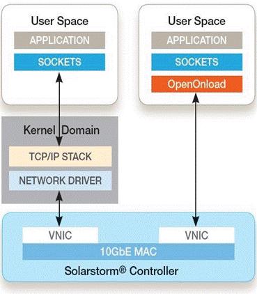

# Install gitbook

## 环境安装

### Node.js安装

官方网站：



直接安装即可。

### gitbook

使用npm安装gitbook，再更新

```text
npm install gitbook-cli -g
gitbook update
```

###  ebook-convert

该组件用于将gitbook导出成pdf

官网：



直接安装即可。


## 创建Github项目

可以将gitbook与github相关，便于clone、commit、pull等。

```text
git clone https://github.com/hlmmd/leetcode
```


## 导出

### HTML网页

使用gitbook serve gitbook目录，即可将gitbook发布到本机4000端口网页，可通过[http://localhost:4000](http://localhost:4000)访问

```text
qinrui@DESKTOP-AVVFLE3 MINGW64 /e/gitbook/leetcode (master)
$ gitbook serve .
Live reload server started on port: 35729
Press CTRL+C to quit ...

info: 7 plugins are installed
info: loading plugin "livereload"... OK
info: loading plugin "highlight"... OK
info: loading plugin "search"... OK
info: loading plugin "lunr"... OK
info: loading plugin "sharing"... OK
info: loading plugin "fontsettings"... OK
info: loading plugin "theme-default"... OK
info: found 4 pages
info: found 1 asset files
info: >> generation finished with success in 1.0s !

Starting server ...
Serving book on http://localhost:4000

```

此时，目录中会多出一个\_book目录，该目录即存放了图书html的目录



### PDF 文件

进入git目录，使用gitbook pdf命令，即可生成Pdf,默认文件名为book.pdf

```text
qinrui@DESKTOP-AVVFLE3 MINGW64 /e/gitbook/leetcode (master)
$ gitbook pdf
info: 7 plugins are installed
info: 6 explicitly listed
info: loading plugin "highlight"... OK
info: loading plugin "search"... OK
info: loading plugin "lunr"... OK
info: loading plugin "sharing"... OK
info: loading plugin "fontsettings"... OK
info: loading plugin "theme-default"... OK
info: found 4 pages
info: found 0 asset files
info: >> generation finished with success in 3.2s !
info: >> 1 file(s) generated

```


